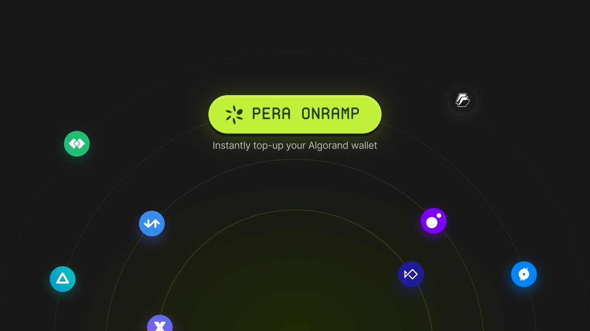

## @perawallet/onramp

Pera Onramp lets users top up in just a few clicks, offering the best rates for ALGO and stablecoins. Easily integrate it into your dApp with JavaScript SDK.

[](https://www.npmjs.com/package/@perawallet/onramp) [](https://www.npmjs.com/package/@perawallet/onramp)

## Quick Start

1. Start by installing `@perawallet/onramp`

```
npm install --save @perawallet/onramp
```

2. Create a `PeraOnramp` instance

```typescript
import {PeraOnramp} from "@perawallet/onramp";

const peraOnramp = new PeraOnramp();
```

3. Tie it to a user action, and start the flow

```typescript
peraOnramp
  .addFunds({
    accountAddress // A valid Algorand account address
  })
  .then(() => {
    // Successfully added funds
  })
  .catch(() => {
    // Failed to add funds
  });
```

## Options

| option          | default                      | value                        |          |
| --------------- | ---------------------------- | ---------------------------- | -------- |
| optInEnabled    | false                        | boolean                      | optional |
| availableAssets | ["ALGO", "USDC-A", "USDT-A"] | ["ALGO", "USDC-A", "USDT-A"] | optional |

## Opt-in Flow

To be able to add funds to an Algorand account, the account needs to be opted-into to related asset (Except for Algo). Some users may not be opted in to USDC or USDT, in that case Pera Onramp also allows you to control your in-app opt-in flow by a simple configuration.

While creating a `PeraOnramp` instance, you can enable the opt-in functionality.

```typescript
const peraOnramp = new PeraOnramp({
  // Enables the Opt-in flow
  optInEnabled: true
});
```

As a result of that configuration, users will be able to select the related asset they haven't opted-in to. The select action will fire an event that you can listen to it with `peraOnramp.on()`

```typescript
peraOnramp.on({
  OPT_IN_REQUEST: ({accountAddress, assetID}) => {
    // You can close the modal, and reopen after opt-in done
    peraOnramp.close();

    // Create opt-in transactions, and send to wallet to sign
    console.log(accountAddress, assetID);
  }
});
```

## Events

Besides the main `addFunds` promise, `on` method allows to subscribe couple of optional events.

| event               | type |                                             |
| ------------------- | ---- | ------------------------------------------- |
| OPT_IN_REQUEST      | void | Once the users selects a non opted-in asset |
| ADD_FUNDS_COMPLETED | void | Funds added successfully                    |
| ADD_FUNDS_FAILED    | void | Funds couldn't be added                     |

```typescript
peraOnramp.on({
  OPT_IN_REQUEST: ({accountAddress, assetID}) => {
    // You can close the modal, and reopen after opt-in done
    peraOnramp.close();

    // Create opt-in transactions, and send to wallet to sign
    console.log(accountAddress, assetID);
  },
  ADD_FUNDS_COMPLETED: () => {
    // You may display a toast
  },
  ADD_FUNDS_FAILED: () => {
    // You may display a toast
  }
});
```

## Methods

#### `PeraOnramp.addFunds({ accountAddress }: AddFundsParams): Promise<PeraOnrampListenerPromiseResolve>`

Starts the fund adding flow.

#### `PeraOnramp.on(callbacks: Callbacks): void`

Sets a listener for specific events and runs a callback.

#### `PeraOnramp.close(): void`

Closes the fund adding flow, and rejects the `peraOnramp.addFunds` promise if exists.

## Contributing

All contributions are welcomed! To get more information about the details, please read the [contribution](./CONTRIBUTING.md) guide first.
